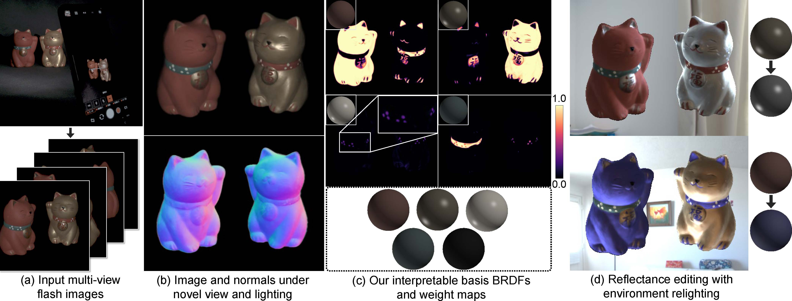

# Differentiable Inverse Rendering with Interpretable Basis BRDFs

### [Project](https://hg-chung.github.io/Interpretable-Inverse-Rendering/) | [Paper](https://arxiv.org/pdf/2411.17994)

This repository contains the implementation of the paper:

**Differentiable Inverse Rendering with Interpretalbe Basis BRDFs**

Hoon-Gyu Chung, Seokjun Choi, Seung-Hwan Baek

***CVPR, 2025***

<p align="center">
    
</p>

## Installation
We recommend you to use Conda environment. Install pytorch3d following [INSTALL.md](https://github.com/facebookresearch/pytorch3d/blob/main/INSTALL.md).

```bash
conda create -n IIR python=3.9
conda activate IIR
conda install pytorch=1.13.0 torchvision pytorch-cuda=11.6 -c pytorch -c nvidia
conda install -c fvcore -c iopath -c conda-forge fvcore iopath
conda install numpy matplotlib tqdm imageio
pip install scikit-image plotly opencv-python open3d lpips kornia icecream, plyfile, submodules/diff-surfel-rasterization, submodules/simple-knn
conda install pytorch3d -c pytorch3d

```

## Dataset
** We utilized multi-view flash image dataset: 4 synthetic scenes and 2 real-world scenes.**

You can download dataset from [Google Drive](https://drive.google.com/file/d/1Qbopa0Df80jDUawfb0yA6eBgN_d_TQVT/view?usp=sharing) and put them in the corresponding folder.

## Train and Evaluation
```bash
sh train.sh
sh evaluation.sh
```

## Citation
If you find this work useful in your research, please consider citing: 
```
@inproceedings{chung2025differentiable,
  title={Differentiable Inverse Rendering with Interpretable Basis BRDFs},
  author={Chung, Hoon-Gyu and Choi, Seokjun and Baek, Seung-Hwan},
  booktitle = {Proceedings of the IEEE/CVF Conference on Computer Vision and Pattern Recognition (CVPR)},
  year={2025}
}
```
## Acknowledgement
Part of our code is based on the previous works:[DPIR](https://hg-chung.github.io/DPIR/), [2D Gaussian Splatting](https://surfsplatting.github.io/), and [R3DGS](https://nju-3dv.github.io/projects/Relightable3DGaussian/).
